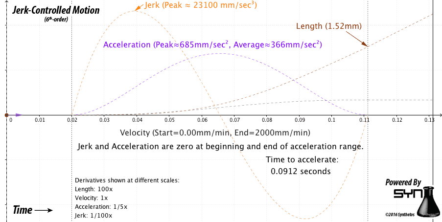
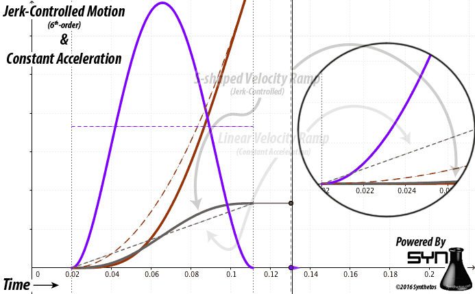

TinyG and G2 Core use **6th-order jerk-controlled** motion planning in real-time. Other motion control systems (both open-source and most proprietary) use **constant acceleration** motion planning for real-time applications. This page explains what those terms mean, and the differences and benefits of controlled-jerk motion planning.

## Why Does It Matter?
Simply put, controlled jerk ("S-curve") motion planning provides better machining results than constant acceleration motion planning. Benefits include:

- Better surface finish - speeds change gradually without discontinuities that result in temporary micro-positional errors
- Less machine vibration and resonance, resulting in less chatter and skip
- Less wear on mechanical parts, as machine "impacts" are greatly reduced
- "Steadier hand" for rapid operations such as pick and place, pipetting, etc.
- Motors run smoother and cooler

Controlled jerk gets more out of the motors. Higher accelerations and better power transfer are possible as the motors do not have to deal with instantaneous changes in acceleration. By overcoming these "worst case" start and stop conditions faster transitions between stop and full speed are possible, as are higher overall acceleration and deceleration speeds.

## What Is Controlled Jerk Motion?

At it's core, controlled jerk motion planning is about ensuring that motors, and hence the entire machine, more closely obey the physics of motion. From a math and physics perspective, the derivatives ("rates of change") of position are velocity (1st derivative), acceleration (2nd derivative), and jerk (3rd derivative). To **_control_** the jerk means to keep it within the limits of the machine. In TinyG and G2 Core the velocity and jerk limits are tunable. 

_Note: In the past TinyG used 3rd-order "constant jerk" motion planning, similar to a form of controlled-jerk motion planning that is found in some commercial products. TinyG has since moved on to even smoother motion control that uses further derivatives "snap" (4th derivative), "crackle" (5th derivative), and "pop" (6th derivative). As far as we know, no commercial CNC products advertise that they use 6th-order motion planning._

*The animations below illustrate a typical acceleration move from 0 mm/min to 2000mm/min, using both controlled jerk and constant acceleration. Settings used are typical for machines such as a Shapeoko2, Shapeoko3, or Xcarve.*

The image above shows a controlled jerk acceleration move with the maximum jerk value set to 23,100 mm/sec^3 (or ~5 billion mm/min^3). The length of the acceleration phase is 1.52 mm, and the time to accelerate is 91.2 milliseconds. This yields an average acceleration of ~366mm/sec^2, starting and ending with zero acceleration, and with a peak acceleration of 685mm/sec^2.

The constant acceleration example uses the average acceleration value from the jerk-controlled example of 366mm/sec^2 as the constant acceleration value. (Default settings for these machines range from 250mm/sec^2 to 400mm/sec^2). The length of the move and the time to accelerate are thus the same.

The start of acceleration (at 0.02 sec in the animation) causes an infinite spike in jerk. Physics dictates that the rise time of the motor acceleration is not zero, hence the jerk is not infinite, but will take effect over time. The mass of the tool resists this instantaneous change, stressing the motor, and either stretching belts or stressing linkages in the machine. This also has a visible effect on the resulting surface finish of the job.

The rate of change of acceleration (jerk) is limited to the amount the motor and its load can actually sustain without stalling, fixing an upper limit on the acceleration setting before the motor stalls or loses steps. In fact, the motor is capable of far greater acceleration once it gets past this critical point, so the "constant" acceleration value used must be set to a lower value than the machine can handle simply to account for these "infinite jerk" points.

You can see in the detail how in the jerk-controlled motion the acceleration (rate of change of velocity) gradually rises from zero and lowers back to zero, matching the physics of overcoming and then maintaining inertia. This gradual start is where most of the benefit is achieved, getting the motor past the infinite jerk point present in the constant acceleration case. Most motors are capable of much higher peak accelerations than the midpoint acceleration shown, so the jerk limit could be raised, therefore faster transitions between stop and full speed are possible.

Transitions from move-to-move are handled in a similar manner; jerk imparted to the machine during cornering stays within the configured limits. This ensures that motion remains smooth, workpiece surface finish is high quality and free of motion-control artifacts, and motor stressing is reduced to known limits so as not to lose steps during cornering.

### How Is This Done in Real-Time?

TinyG is able to plan and execute motion with 6th-order jerk control in real-time with math that is optimized to run on small, inexpensive microcontrollers, including 32-bit ARM processors (G2 Core project) and 8 bit Atmel Xmega (TinyG project). 

The math used is as accurate as the floating point math of the processors allows for, and motion is true to the provided GCode within the configured machine limits. The inevitable inaccuracies of floating point math are accounted for and corrected: positional accuracy is maintained at the fractional-microstep level over jobs of any length.

The gradual handling of start and stop conditions also reduces the possibility of stepper stalling. Combine that with very carefully controlled step timing that prevents step-timing artifacts (such as "bunching" and "scalloping" of diagonal moves) and the result is overall higher resulting surface finish for the same mechanics, motors, and power supply, with the job being accomplished in the same amount of time or less.